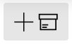

# Get Started
{: .no_toc }

  

    Table of contents
  

  {: .text-delta }
1. TOC
{:toc}

## Compatibility and Download

- Currently for Windows 10 and 11 only (Mac version planned)
- Distributed via the Microsoft Store
- [View web version of the Store](https://www.microsoft.com/store/apps/9N020ZXP2Z1G?cid=storebadge&ocid=badge), or [directly launch the Store app](ms-windows-store://pdp/?ProductId=9N020ZXP2Z1G)

---

## Add Source(s) to organize

- Click on the **Add Source**  button.
- Select **Local folder** in the menu.      
- Select a folder which you wish to organize better with Ritt. 

Source(s) will show up on the right (main) pane.
<video autoplay loop controls>
  <source src="/img/v0.9-MP4-Add-Source.mp4" type="video/mp4">
</video>

---

## Navigation

- Navigation in Ritt is similar to that in File Explorer.
- Double click on a folder to navigate inside, double click on a file to open it.
- Click on any folder in the Address bar for quick navigation. The scroll wheel on your mouse can be used to scroll horizontally.  

---

## Add Tags

- Click on the **Add Tag**  button to add a new tag.
- Enter a suitable name for the new tag.     
- After the first tag has been created, you can also add new tags by dragging and dropping the **Add Tag** button to a desired position in the list of existing tags.  
  <video autoplay loop controls>
    <source src="/img/v0.9-MP4-Add-Tag-Drag-and-Drop.mp4" type="video/mp4">
  </video>

---

## Tagging files/folders

- Navigate to and select the file(s) or folder(s) that you wish to tag.
- Tag the item(s) by clicking on the empty circle next to the tag.   
  <video autoplay loop controls>
    <source src="/img/v0.9-MP4-Tagging-an-item.mp4" type="video/mp4">
  </video>

---

## Creating nested tags

- When you create many tags, you may want to organize the tags hierarchically.
- Drag and drop children tags into parent tags.  
  <video autoplay loop width="800" controls>
    <source src="/img/v0.9-MP4-Create-nested-tags.mp4" type="video/mp4">
  </video>

---

## Activating a tag

- In the tag tree (left panel), navigate to and click on a desired tag to activate it.
- Tagged items will be displayed in the right panel.
- You can also view [*Related Tags*](/tags/related-tags) (if any) through a dropdown menu next to the Search bar.
   

---

## Activating multiple tags

- Click on another tag under *Related Tags* to activate it. You will now see items that are tagged to both tags.
- Alternatively, in the tag tree on the left pane, Ctrl + click (or middle mouse button click) on another tag to activate it.   

---

## Integrating folders and tags

- In Ritt, you can drag and drop a folder into the tag pane. This folder can now also behave like a tag, you can tag items from other locations to it! 
<video autoplay loop controls>
<source src="../img/v0.9-MP4-Integrating-folders-and-tags.mp4" type="video/mp4">
</video>

