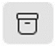
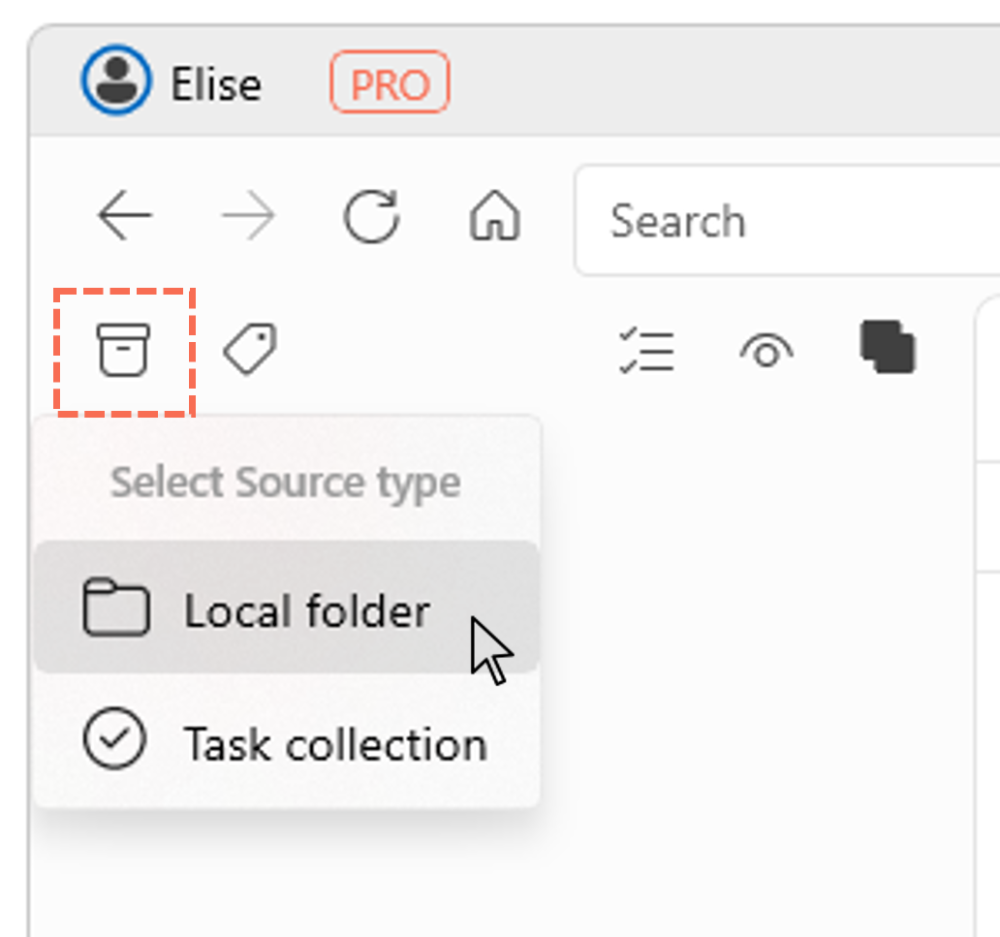
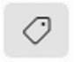
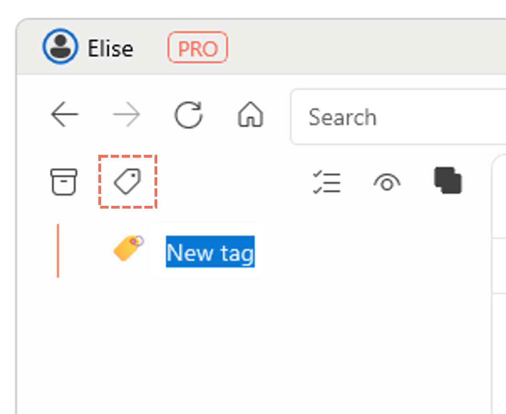

# Get Started
{: .no_toc }

  

    Table of contents
  

  {: .text-delta }
1. TOC
{:toc}

## Compatibility and Download

- Currently for Windows 10 and 11 only
- Distributed via the Microsoft Store
- [View web version of the Store](https://www.microsoft.com/store/apps/9N020ZXP2Z1G?cid=storebadge&ocid=badge), or [directly launch the Store app](ms-windows-store://pdp/?ProductId=9N020ZXP2Z1G)
- Alternatively, download directly from the [Ritt website](https://ritt.app/download.html)

---

## Add Source(s) to organize

- Click on the **Add Source**  button.
- Select **Local folder** in the menu.     
- Select a folder which you wish to organize better with Ritt. 

Source(s) will show up on the right (main) pane.
<video autoplay loop controls>
  <source src="/img/v1.0-MP4-Add-Source-Local-Folder.mp4" type="video/mp4">
</video>

---

## Navigation

- Navigation in Ritt is similar to that in File Explorer.
- Double click on a folder to navigate inside, double click on a file to open it.
- Click on any folder in the Address bar for quick navigation. The scroll wheel on your mouse can be used to scroll horizontally.    
- You can in fact drag and drop a folder to the left pane (the tag pane). This will make navigation easier, and also allow you to make use of additional features to customize your database. More on that later.

---

## Add Tags

- Click on the **Add Tag**  button to add a new tag.
- Enter a suitable name for the new tag.     
- After the first tag has been created, you can also add new tags by dragging and dropping the **Add Tag** button to a desired position in the list of existing tags.  
  <video autoplay loop controls>
    <source src="/img/v1.0-MP4-Add-Tag-Drag-and-Drop.mp4" type="video/mp4">
  </video>

---

## Tagging files/folders

- Navigate to and select the file(s) or folder(s) that you wish to tag.
- Tag the item(s) by clicking on the empty circle next to the tag.
- Ritt offers many different ways to tag your files and folders, including **automated tagging**! Find out more [here](/tags/tagging-files-folders-or-tasks).  
  <video autoplay loop controls>
    <source src="/img/v1.0-MP4-Tag-Item.mp4" type="video/mp4">
  </video>

---

## Creating nested tags

- When you create many tags, you may want to organize the tags hierarchically.
- Drag and drop children tags into parent tags.  
  <video autoplay loop controls>
    <source src="/img/v1.0-MP4-Creating-Nested-Tags.mp4" type="video/mp4">
  </video>

---

## Activating a tag

- In the tag tree (left panel), navigate to and click on a desired tag to activate it.
- Tagged items will be displayed in the right panel.
- You will see the active tag in the Address bar, along with other [*related tags*](/tags/related-tags) next to it (greyed out when not selected). Related tags are tags which have common items with currently activated tag(s).
- The grouping for the display of the tagged items is [customizable](/general/grouping-items).
  

---

## Activating multiple tags

- Click on another *related tag* to activate it. You will now see items that are tagged to both tags.
- Alternatively, in the tag tree on the left pane, `Ctrl` + click (or middle mouse button click) on another tag to activate it.   

---

## Integrating folders and tags

- In Ritt, you can drag and drop a folder into the tag pane. This folder can now also behave like a tag, you can tag items from other locations to it!
- Watch the video below for a one-minute demo.   
  <video controls>
  <source src="../img/v1.0-MP4-Integrating-Folders-and-Tags.mp4" type="video/mp4">
  </video>

