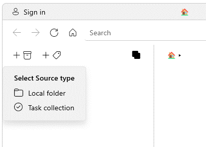

# Types of Sources
v1.2
{: .label .label-purple}

A Source is a folder that contains items which you wish to organize using Ritt. There are two kinds of Sources.

1. **Local folder** - Any folder that is accessible with File Explorer
1. **Task collection** - A virtual folder that contains tasks

You can add multiple sources into a single Ritt database.

