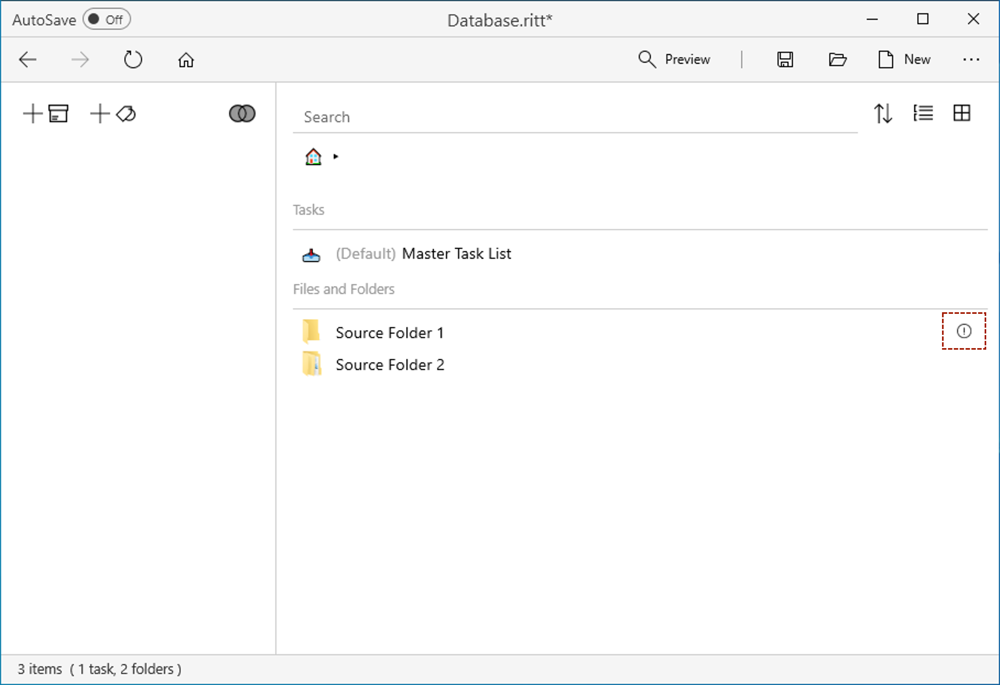
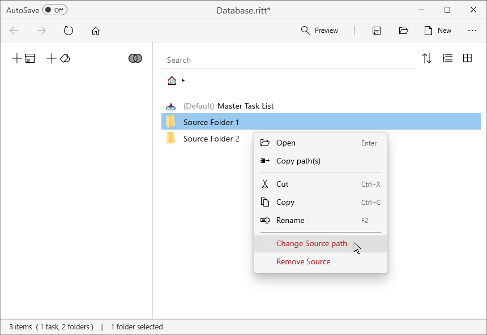

# Changing the path of a Source

If a Source folder is moved to another location in your computer, Ritt may not be able to locate it. In this case, you will see a circle with an exclamation mark next to the Source, indicating that the Source path needs to be updated. 
- Click on the circle to update the Source path.     

In some rare cases, you may wish to intentionally change the path of a Source (for example, if you have two copies of the same Source folder in different locations and need to switch between them periodically). In this case, follow the steps below.

- Right click on a Source and select **Change Source path**. Select the new location of the Source.
- All tags relative to the original Source will not be affected (i.e., they will be migrated over to the "new" Source).  