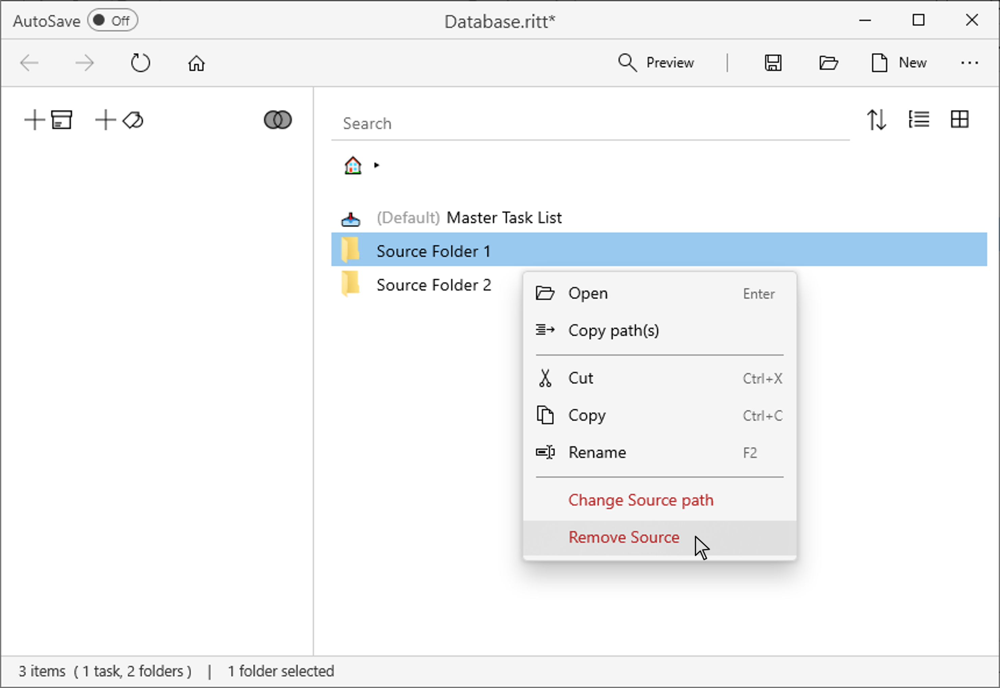

# Removing Source(s)
v0.7
{: .label .label-blue}

- Right click on a Source and select **Remove Source**.
- Removing a Source will remove it from the current Ritt database. The actual folder and the subfolders and files within will not be affected.  