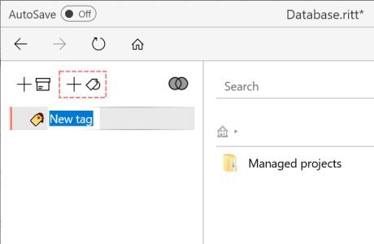

# Adding a new tag

- Click on the **Add Tag**  button to add a new tag.
- Enter a suitable name for the new tag.     
- You can also add new tags by dragging and dropping the **Add Tag** button to a desired position in the list of existing tags.  
    <video autoplay loop width="500" controls>
    <source src="../img/MOV-Drag-Drop-New-Tag.mov" type="video/mp4">
    </video>