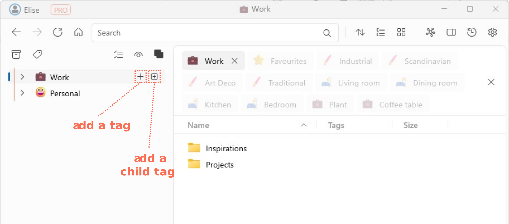

# Adding a new tag

- Click on the **Add Tag**  button to add a new tag.
- Enter a suitable name for the new tag.   
      
- You can also add new tags by dragging and dropping the **Add Tag** button to a desired position in the list of existing tags.  
    <video autoplay loop controls>
    <source src="../img/v1.2-MP4-Adding-Tag-by-Drag-and-Drop.mp4" type="video/mp4">
    </video> 

- Another alternative way to add a new tag is to mouse over an existing tag, and click on either theorbutton that appears.  
