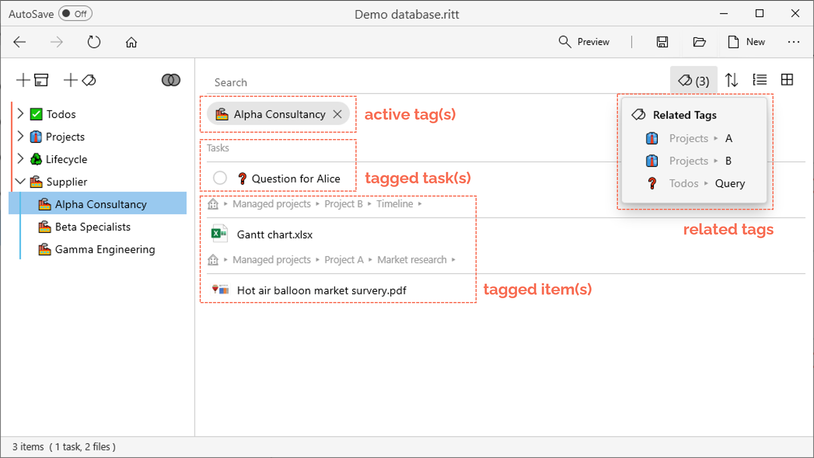
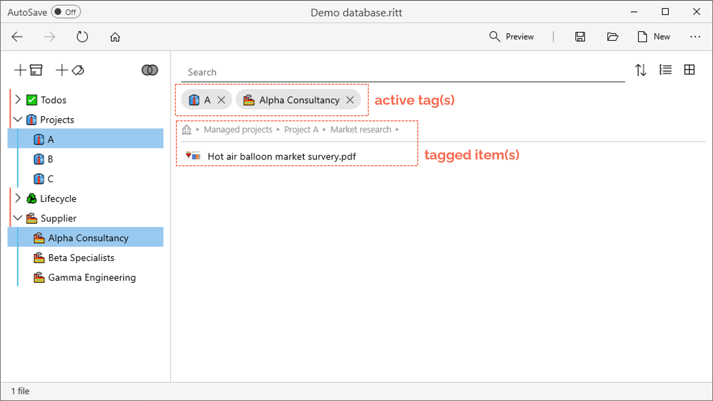

# Activating tags

## Activating a tag

- In the tag tree (left panel), navigate to and click on a desired tag to activate it.
- Tagged items will be displayed in the right panel.
- You can also view [*Related Tags*](/tags/related-tags) (if any) through a dropdown menu next to the Search bar.
   

---

## Activating multiple tags

- Click on another tag under *Related Tags* to activate it. You will now see items that are tagged to both tags.
- Alternatively, in the tag tree on the left pane, Ctrl + click (or middle mouse button click) on another tag to activate it.   