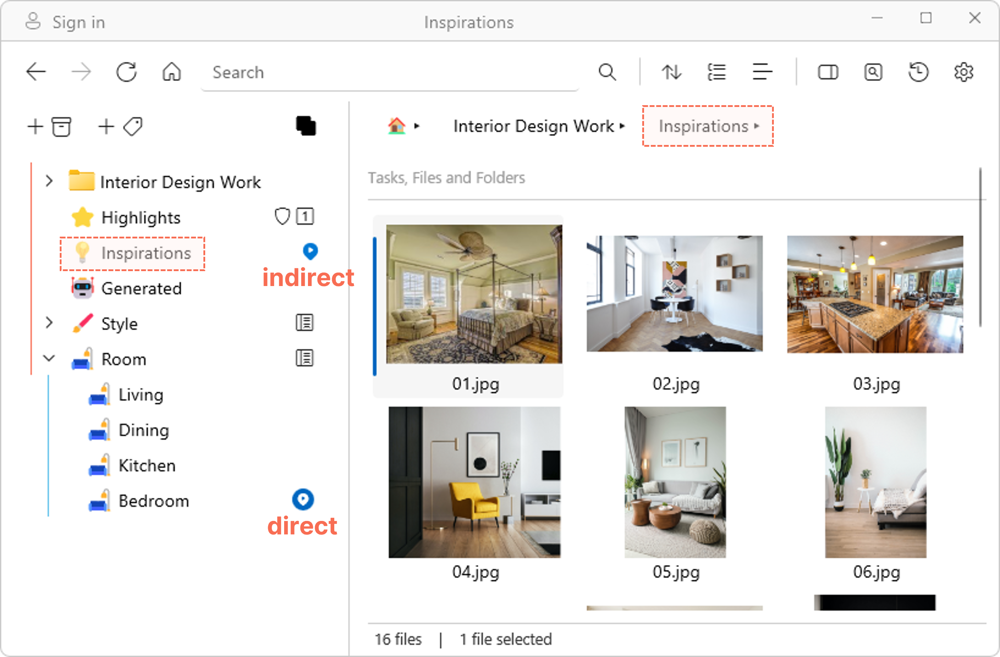

# Tagging files, folders, or tasks
v1.2
{: .label .label-purple}

- Navigate to and select the file(s), folder(s) or task(s) that you wish to tag.
- Tag the item by clicking on the empty circle next to the tag. This creates a *direct* tag.   
    <video autoplay loop controls>
    <source src="../img/v1.2-MP4-Tagging-an-Item.mp4" type="video/mp4">
    </video>

When you tag a folder, all items within that folder become *indirectly* tagged to that tag. In the example below, the "Inspirations" folder is tagged to the <mark style="background-color: #FFF0EE">Inspirations</mark> tag on the left pane. The image "01.jpg" is an item inside the "Inspirations" folder, and hence it is *indirectly* tagged to <mark style="background-color: #FFF0EE">Inspirations</mark>. It is also *directly* tagged to <mark style="background-color: #FFF0EE">Bedroom</mark>  

## Tagging items from the Details Pane

The Details Pane offers an alternative, possibly faster way to tag your items.

- Click on an item (or multiple items).
- Show the Details pane by clicking on the **Show/Hide Details pane**button on the top banner.
- In the Details pane, you will see section called **Tags**.
- Add new tags by typing directly into the "Add a new tag" box. This searches all existing tags. Hit `Tab` to select the first tag on the list, or use arrow keys to select the tag you are looking for. 
- You can also use this section to add a new tag that does not currently exist. The new tag will be added to the bottom of the tag tree.
- Watch the video below for a demo.  
  <video controls>
  <source src="../img/v1.2-MP4-Tagging-from-Details-Pane.mp4" type="video/mp4">
  </video>