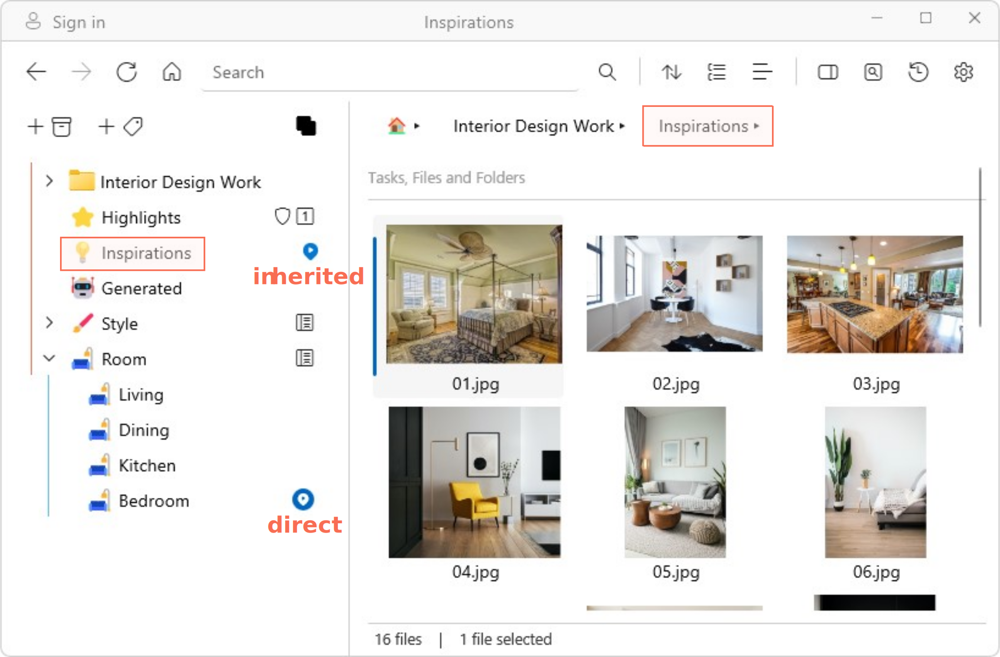

# Inherited tags

When you tag a folder, all items within that folder *inherit* the folder tag (i.e. all nested items have an *inherited* tag). 

In the example below, the "Inspirations" folder is *directly* tagged to the <mark style="background-color: #FFF0EE">Inspirations</mark> tag on the left pane. The image "01.jpg" is an item inside the "Inspirations" folder, and hence it has an *inherited* <mark style="background-color: #FFF0EE">Inspirations</mark> tag. It is also *directly* tagged to <mark style="background-color: #FFF0EE">Bedroom</mark>  