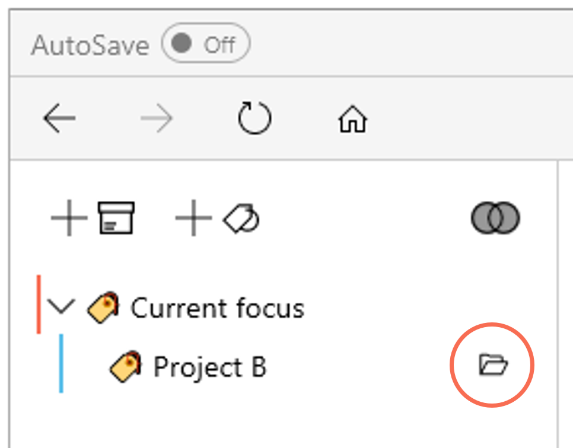

# Creating a tag out of an item

Sometimes, you may wish to turn an existing item (e.g., a folder, a file or a task) into a tag.

- Drag and drop the item to a desired position in the tag tree on the left pane. This will create a tag with the same name as the item, and the item itself will be tagged to this new tag. 

(Note: Renaming or deleting this tag will not affect the original item.)

## Creating mirror tags

Creating a tag out of a **folder** or a **task collection** in this manner will create a **mirror tag** with some special properties. 
<video autoplay loop width="800" controls>
<source src="../img/MOV-Add-Mirror-Tag.mov" type="video/mp4">
</video>

When you drag and drop a folder onto the tag pane, it will create a mirror tag with the same name as the folder, and the folder itself will be tagged to this new tag. Any items within the folder will also be indirectly tagged to the mirror tag. Renaming the mirror tag does not affect the name of the original folder.

Mirror tags have an attributethat is displayed next to the tag. This attribute can be turned on or off. 
  

A mirror tag serves both as a tag and as a folder. When you select a mirror tag, it shows the contents of the folder. You can also add new files or subfolders into this folder, because Ritt knows the exact location to add them to.

Tag relevant items from other locations to this mirror tag to see all items related to a project in one place! Play the video below to see a demo. 
<video width="800" controls>
<source src="../img/MP4-Mirror-Tags.mp4" type="video/mp4">
</video>