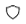
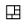
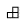
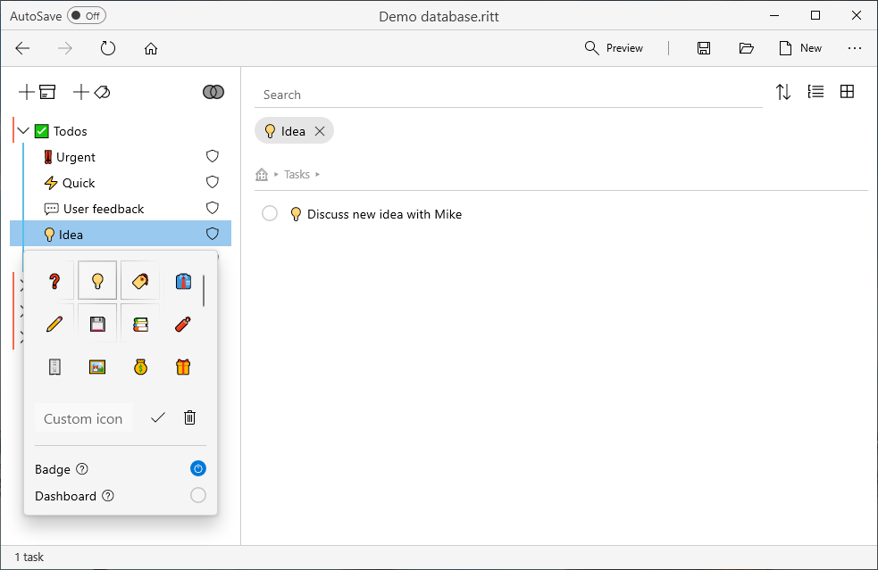

# Tag icon and attributes

- Right click on a tag and select **Icon and Attributes**.
- Here you can assign an icon (emoji) to your tag.
- Check the attribute **Badge** to show the tag icon in front of all items with that tag. The attribute symbolwill appear next to the tag.
- Check the attribute **Mirror** to [create a mirror tag](/tags/creating-a-tag-out-of-an-item#creating-mirror-tags). The attribute symbolwill appear next to the tag.
- Check the attribute **Dashboard** to include and show all items tagged to the children tag(s) of the selected tag. The attribute symbolwill appear next to the tag. Click [here](/tags/dashboard-tags) to read more about dashboard tags.

If a tag has more than one attribute, the symbolwill appear next to the tag.

