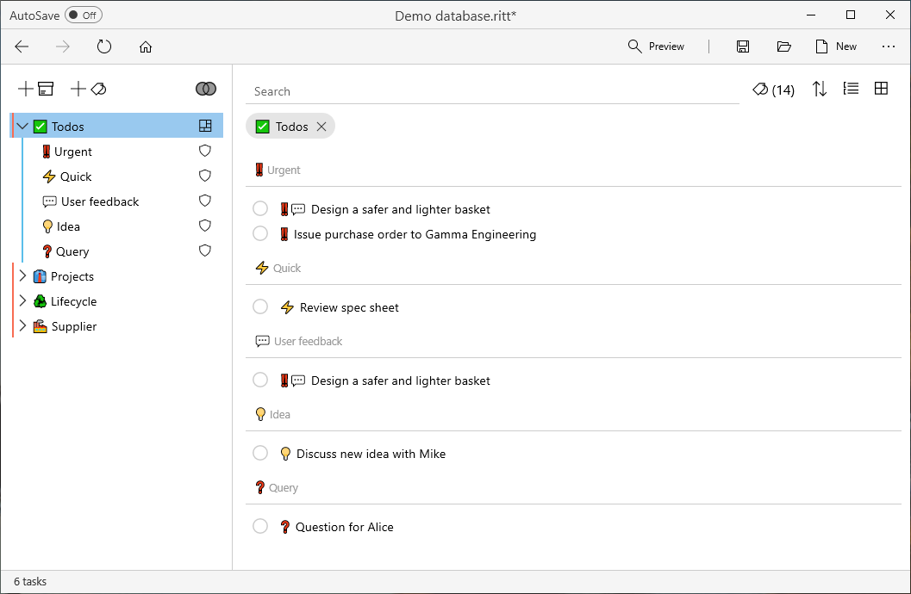

# Dashboard tags
v0.7
{: .label .label-blue}

Dashboard tags are tags with the Dashboard attribute turned on. When you click on a dashboard tag, you will see items which are directly tagged to the dashboard tag, as well as all items tagged to the children tag(s). These items are grouped by the children tags.

Use this feature to help you quickly gain an overview of all items related to a parent tag!

