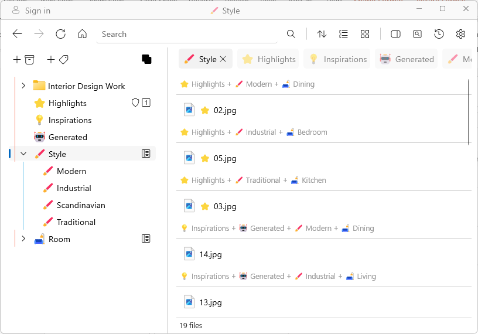

# Tag attributes

- Right click on a tag and go to **Attributes**.
- There are three attributes that can be assigned to a tag - Badge, Dashboard and Hot Key.  

## Badge attribute

- Check the attribute **Badge** to show the tag icon in front of all items with that tag. The attribute symbolwill appear next to the tag in the left pane.   

## Dashboard attribute

- Check the attribute **Dashboard** to include and show all items tagged to the children tag(s) of the selected tag. The attribute symbolwill appear next to the tag on the left pane. 
- When a tag with the Dashboard attribute is selected, you will see items which are directly tagged to the dashboard tag, as well as all items tagged to the children tag(s). You can choose to group the items either by tag or by location.  

## Hot Key attribute

- Assign a hot key to your most commonly-used tags!
- There are 10 possible hot keys - **1 to 9 and 0**. Once you assign a hot key to a tag, you will see the hot key attribute symbol next to the tag on the left pane (a little square with the number you have selected).
- To tag an item with the hot key, simply select an item, and hit the hot key to tag or untag the item.  

