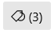
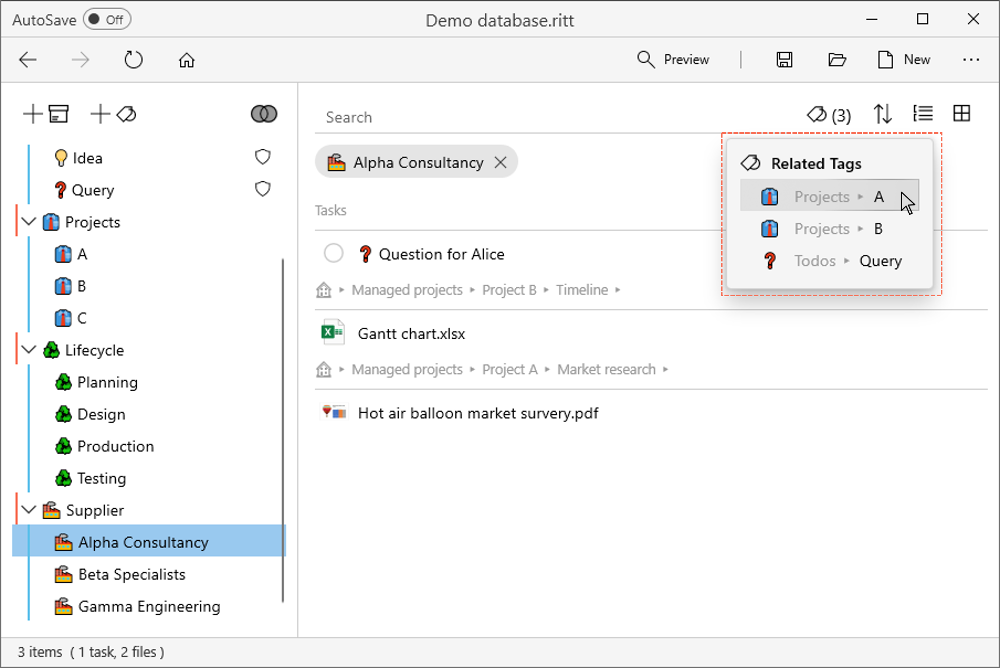
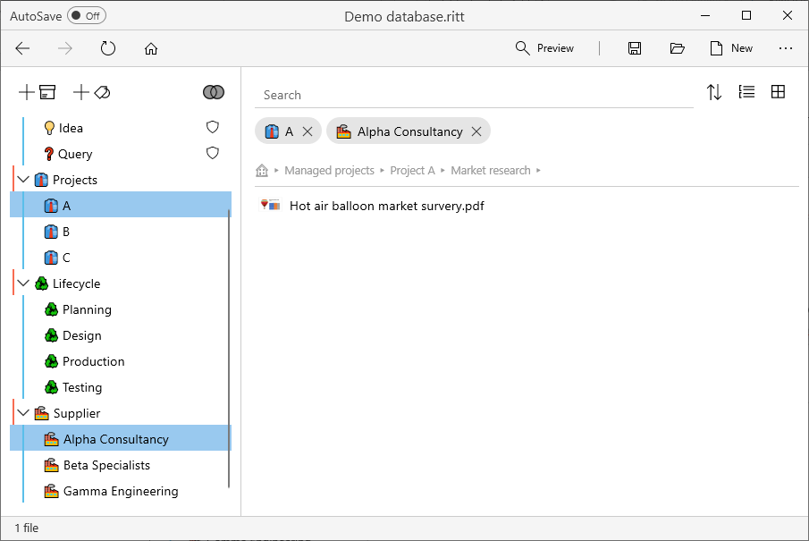

# Related tags
v0.7
{: .label .label-blue}

Related tags are tags which have common items with currently activated tag(s). This feature helps you to quickly locate the files you are looking for by "narrowing your search".

After [activating one or more tags](/tags/activating-tags), you will see a button  next to the Search bar if related tags are available. (The number in brackets is the number of related tags available.)

- Click on this button to show the related tags.    

- Select a related tag, and that tag will also be activated alongside any others that have already been activated. In the main panel, you will see items which are tagged to all the activated tags.    