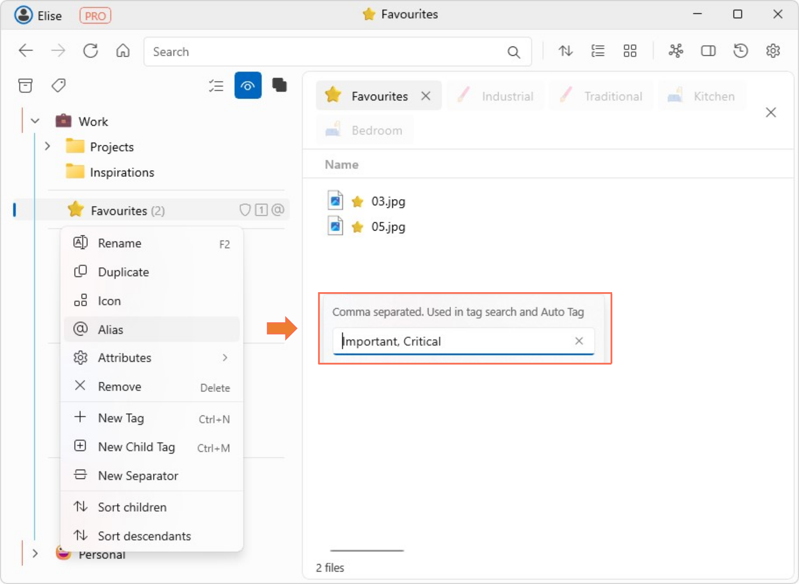

# Tag alias

- Right click on a tag and go to **Alias**.
- Here you can assign one or more aliases, i.e., other names you would like to call the tag. Names should be separated by a comma. These names are used in tag search and auto tag. 
- When a tag has alias(es) assigned to it, the @ symbol will appear next to the tag in the tag pane.  
