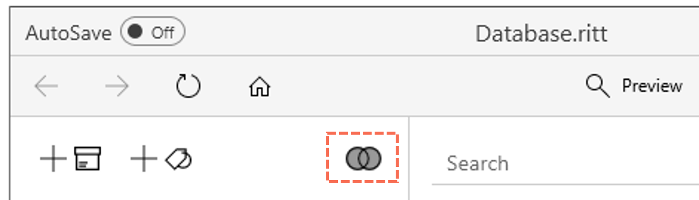
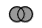
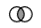
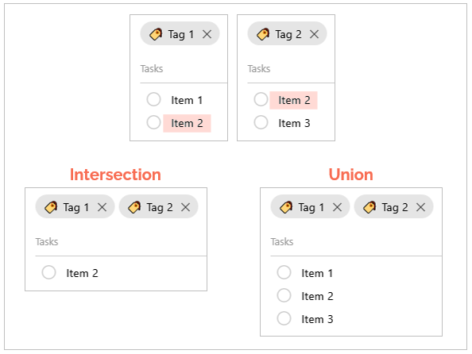

# Intersection mode vs. Union mode

When you [activate multiple tags](/tags/activating-tags#activating-multiple-tags), you can decide if you would like to view tagged items in intersection mode or union mode.

1. **Intersection mode** - view items that are tagged to ***all*** of the activated tags

2. **Union mode** - view items that are tagged to ***any*** of the activated tags

The default mode is the intersection mode. To toggle between the two modes, click on the button with two circles at the top right-hand corner of the tag pane.   

---

- Click onto switch to the union mode.

- Click onto switch to the intersection mode.

