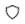

# Tag attributes

- Right click on a tag and go to **Attributes**.
- There are four attributes that can be assigned to a tag - Badge, Encapsulate, Hidden, and Hot Key.  

## Badge attribute

- Select the **Badge** attribute to visually show the tag icon, tag name, or both, in front of all items with that tag. The attribute symbolwill appear next to the tag in the tag pane.   

## Encapsulate attribute

- Select the **Encapsulate** attribute to include and show all items tagged to the children tag(s) of the selected tag. The attribute symbolwill appear next to the tag on the tag pane. 
- When a tag with the Encapsulate attribute is selected, you will see items which are directly tagged to this tag, as well as all items tagged to its children tag(s). You can choose to group the items either by tag or by location.  

## Hidden attribute

- Select the **Hidden** attribute to hide the selected tag(s).
- You can choose whether to show or hide hidden tags using thebutton in the tag pane.

## Hot Key attribute

- Assign a hot key to your most commonly-used tags!
- There are 10 possible hot keys - **1 to 9 and 0**. Once you assign a hot key to a tag, you will see the hot key attribute symbol next to the tag on the left pane (a little square with the number you have selected).
- To tag an item with the hot key, simply select an item, and hit the hot key to tag or untag the item.  

