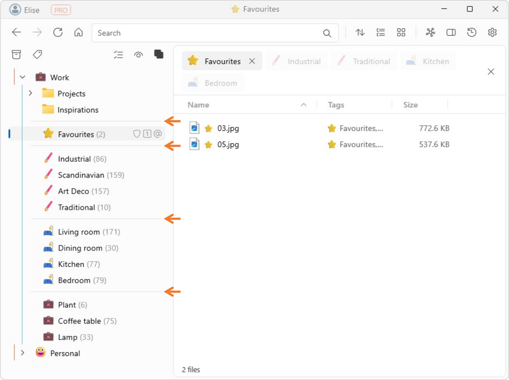

# Organizing the tag pane with separators

- Right click on a tag in the tag pane, and select **New Separator**. This will add a horizontal separator under the selected tag.
- Move and rearrange the separator as you like.
- To delete a separator, either hit the `DELETE` key on your keyboard, or right click and select **Remove**.   