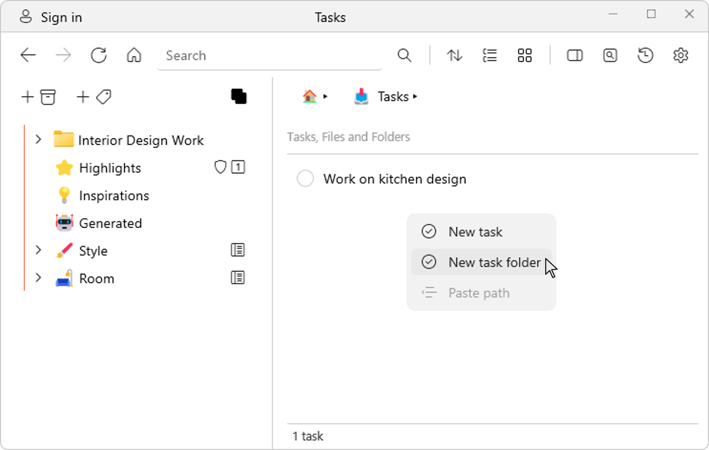

# Organizing tasks

In Ritt, you can add tasks to a task collection, or multiple task collections. You can also add tasks to specific folders, right where your files are. In addition, you can also create task folders, which are essentially sub-folders within a task collection.

- Right-click within a task collection or folder and select **New task folder**.  

