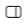

# Linking items such as files and folders to tasks
v1.2
{: .label .label-purple}

Wouldn't it be nice if you could click on a task, and immediately access the file(s) that you need to work on to complete that task?

Ritt allows you to do just that!

To link an item to a task (i.e., a file, folder or task - yes, you can link tasks together!), follow the steps below.

- Click on a task.
- Show the Details pane by clicking on the **Show/Hide Details pane**button on the top banner.
- In the Details pane, you will see section called **Linked items**. You can drag and drop an item here to link it to the task!
- If the item that you want to link is not in the current view, you can **pin** the Details pin by toggle the pin icon at the top of the Details pane (just under the item name).  

- Watch the video below for a demo.  
  <video controls>
  <source src="../img/v1.2-MP4-Linking-Items-to-Tasks.mp4" type="video/mp4">
  </video>

