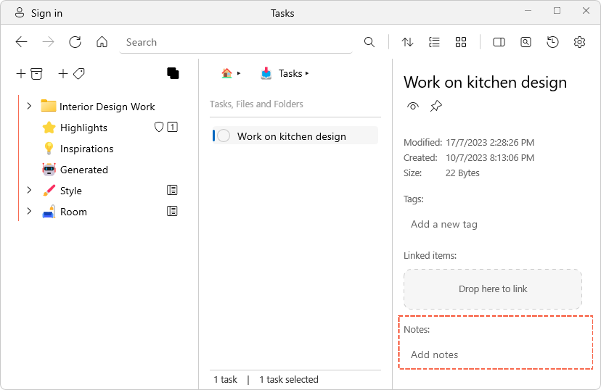

# Adding notes to tasks

Sometimes you may want to add more details to describe a task. In Ritt, you can do this in two ways, by simply adding additional lines to the task item itself, or by using the Notes section in the Details pane.

### Method 1: Adding additional lines to a task

- Double click on a task to show its full details.
- Use the text box to key in additional details. Only the first line of the task will appear in the main view. Anything that you type here will be searchable using the Search bar.  
    <video autoplay loop controls>
    <source src="../img/v1.2-MP4-Adding-Notes-to-Tasks.mp4" type="video/mp4">
    </video>

### Method 2: Using the Notes section under the Details pane

- Click on a task.
- Show the Details pane by clicking on the **Show/Hide Details pane**button on the top banner.
- In the Details pane, you will see section called **Notes**. Type your notes here! (Note: These notes are currently not searchable using the Search bar.)  

