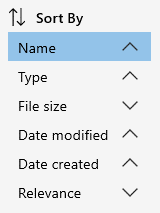

# Sorting items

In Ritt, you can sort the items in the main pane by the following properties - Name, Type, File size, Date modified, Date created, and Relevance.

- Click on the **Sort**button on the top banner.
- Click on the little arrows to the right of each property to sort the items accordingly.   

