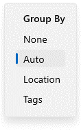

# Grouping items
v1.2
{: .label .label-purple}

In Ritt, you can sort the items in the main pane by the following properties - Name, Type, File size, Date modified, Date created, and Relevance.

- Click on the **Group By**button on the top banner.
- Select one of the following options
    - *None* - No grouping, the items will appear in a single list.
    - *Location* - The items will be grouped by the physical location (based on the original folder structure).
    - *Tags* - The items will be grouped by tags or combinations of tags.
    - *Auto* - This is the default selection. Generally, if a folder or integrated folder is selected, the items will be grouped by location. If a tag is selected, the items will be grouped by tags.  

