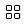

# List or Grid view

- Click on the **List or Grid view**button on the top banner to toggle between List and Grid view.
- In Grid view, you can hold down the `Ctrl` key and use the mouse scroll wheel to change the size of the grids.  

<video autoplay loop controls>
<source src="../img/v1.2-MP4-List-Grid-View.mp4" type="video/mp4">
</video>
