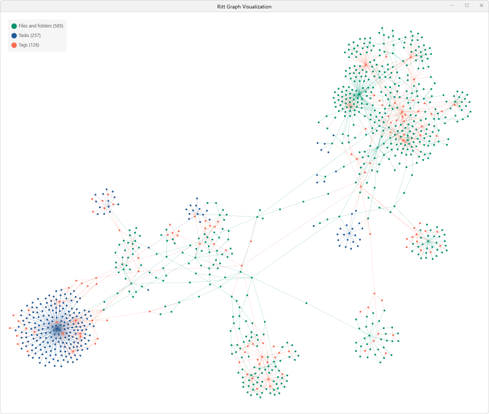

# The Graph Visualization
v1.2
{: .label .label-purple}

Here's a really cool way to look at your data (folders, files, tags, tasks).

- Click on the **Graph visualization**button on the top banner to open the graph visualization window. 
- Use the mouse scroll wheel to zoom in and out.
- Click on a node (item) to see its connections to other items and/or tags. This will also navigate to the item in Ritt.
- You can drag nodes around, explore the different connections within your folder and tag structure. Have fun!

Here's Xiaoye (our founder)'s graph!

