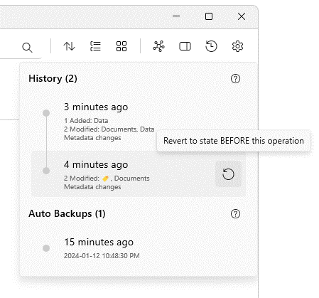

# Version history and backups

Ritt saves up to 200 previous steps in its History log. This is cleared each time Ritt is closed. Ritt also automatically backs up every 12 hours and the backups are kept for 30 days.

- Click on the **History and Backups**button on the top banner to view recent action history and backups.
- To revert to a previous state (i.e., similar to using a typical undo function), hover over a previous step and click on the button. This will revert Ritt to the state *before* that step was taken.

Note that History can only revert changes to tags and tasks. It cannot undo changes to files and folders (e.g., renaming, deleting or moving files or folders).

For the History function to work, Ritt Database AutoSave must be turned on (under Settings > Database).

