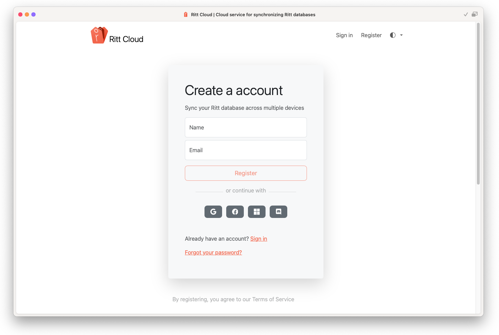

# Signing up for Ritt Cloud

Create an account on Ritt Cloud ([https://cloud.ritt.app](https://cloud.ritt.app)) to maintain your subscription, view details of all your devices that are synced to Ritt Cloud, and view sync history.

- To sign up for an account, go to [Ritt Cloud](https://cloud.ritt.app) (or click on the *Sign in* button from Ritt - top left hand corner).
- Click on *Register* on the top navigation bar.
- Register using your email address, or with a Google, Facebook, Microsoft, or Discord account.

