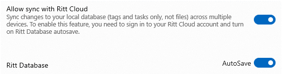

# Syncing your tags and tasks

This is a PRO feature.

- In Ritt, under **Settings &rarr; Ritt Cloud**, ensure that *Auto sync with Ritt Cloud* and *Ritt Database AutoSave* are turned on.  

Ritt automatically syncs your tags and tasks to Ritt Cloud as you make changes. On the Ritt Cloud dashboard, you will be able to see your recent sync history (up to 30 entries). You can restore Ritt to an earlier state by clicking on the *Restore* button at the end of a row.