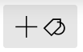

# Get Started

## Compatibility and Download

- Currently for Windows 10 and 11 only (Mac version planned)
- Distributed via the Microsoft Store
- Free 30-day trial before purchase
- [View web version of the Store](https://www.microsoft.com/store/apps/9N020ZXP2Z1G?cid=storebadge&ocid=badge), or [directly launch the Store app](ms-windows-store://pdp/?ProductId=9N020ZXP2Z1G)

## Create a new Ritt database

- Click on the **New** button in the top banner.

## Add Source(s) to organize

- Click on the **Add Source**  button.
- Select **Local folder** in the menu.  
- Select a folder which you wish to organize better with Ritt.

## Navigation

- Similar to File Explorer.
- Double click on a folder to navigate inside, double click on a file to open it.
- Click on any folder in the Address bar for quick navigation. Scroll wheel can be used to scroll horizontally. 

## Add Tags

- Click on the **Add Tag**  button to add new tags.
- Enter a suitable name for the new tag.  
- After the first tag has been created, you can also add new tags by dragging and dropping the Add Tag button to a desired position in the list of existing tags.  <video src="/img/Media1.mp4"></video>

## Tagging files/folders

- Navigate to and select the files or folders that you wish to tag.
- Tag item by clicking on the empty circle next to the tag.  

## Creating tag trees

- When you create many tags, you may want to organize the tags hierarchically.
- Drag and drop children tags into parent tags.  

## Activating a tag

- In the tag tree (left panel), navigate to and click on desired tag to activate it
- Tagged items will be displayed  

## Activating multiple tags

- Notice that other relevant tags are automatically presented in the right panel
- Double click on another tag to activate it
- Alternatively, in the tag tree, navigate to the desired tag and Control + click (or middle mouse button click) to activate it  