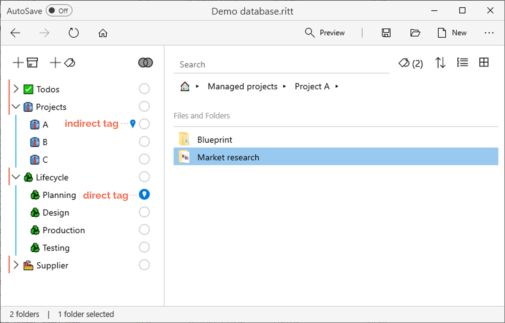

# Tags

## Adding a new tag

- Click on the **Add Tag**  button to add a new tag.
- Enter a suitable name for the new tag.     
- After the first tag has been created, you can also add new tags by dragging and dropping the **Add Tag** button to a desired position in the list of existing tags.  
    <video autoplay loop width="500" controls>
    <source src="/img/MOV-Drag-Drop-New-Tag.mov" type="video/mp4">
    </video>

---

## Tagging files, folders, or tasks

- Navigate to and select the files, folders or tasks that you wish to tag.
- Tag the item by clicking on the empty circle next to the tag. This creates a *direct* tag.     

When you tag a folder, all items within that folder become *indirectly* tagged to that tag. In the example below, the folder "Market research" is directly tagged to <mark style="background-color: #FFF0EE">Planning</mark>, but because it is also a subfolder of "Project A" (which is tagged to <mark style="background-color: #FFF0EE">Projects &#x25B6; A</mark>), it will also be indirectly tagged to <mark style="background-color: #FFF0EE">Projects &#x25B6; A</mark>.   

---

## Creating nested tags

- When you create many tags, you may want to organize the tags hierarchically.
- Drag and drop children tags into parent tags.  
    <video autoplay loop width="500" controls>
    <source src="/img/MOV-Drag-Children-to-Parent-Tag.mov" type="video/mp4">
    </video>

---

## Tag icon and attributes

- Right click on a tag and select **Icon and Attributes**.
- Here you can assign an icon (emoji) to your tag.
- Check the attribute **Badge** to show the tag icon in front of all items with that tag.
- Check the attribute **Skip-Level** to include and show all items tagged to the children tag(s) of the selected tag.  

---

## Renaming, Duplicating, or Removing tags

- To rename a tag, right click on the tag and select **Rename**, or hit the `F2` key on your keyboard.
- To duplicate a tag, right click on the tag and select **Duplicate**.
- To remove a tag, right click on the tag and select **Delete**, or hit the `DELETE` key on your keyboard.

---

## Mirror tags

- To create a mirror tag, simply drag and drop the item (e.g., a file, folder, or task) to a desired location on the left pane. 

This will create a tag with the same name as the item, and the item itself will be tagged to this new tag. If a mirror tag is created out of a folder, any items within the folder will also be indirectly tagged to the mirror tag. 
<video autoplay loop width="800" controls>
<source src="/img/MOV-Add-Mirror-Tag.mov" type="video/mp4">
</video>

---

## Related tags

Simply speaking, related tags are tags which have common items with currently activated tag(s). This feature helps you to quickly locate the files you are looking for by "narrowing your search".

After [activating one or more tags](/get-started#activating-a-tag), you will see a button  next to the Search bar if related tags are available. (The number in brackets is the number of related tags available.)

- Click on this button to show the related tags.    

- Select a related tag, and that tag will also be activated alongside any others that have already been activated. In the main panel, you will see items which are tagged to all the activated tags.    

---

## Tag union vs. intersection

xxx

---

## Show / Select tags

xxx

