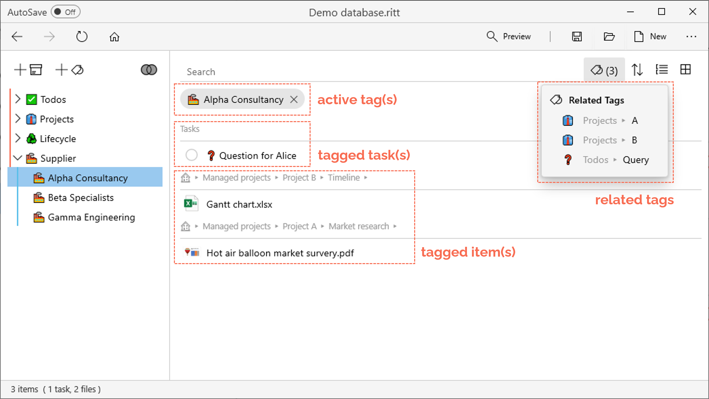
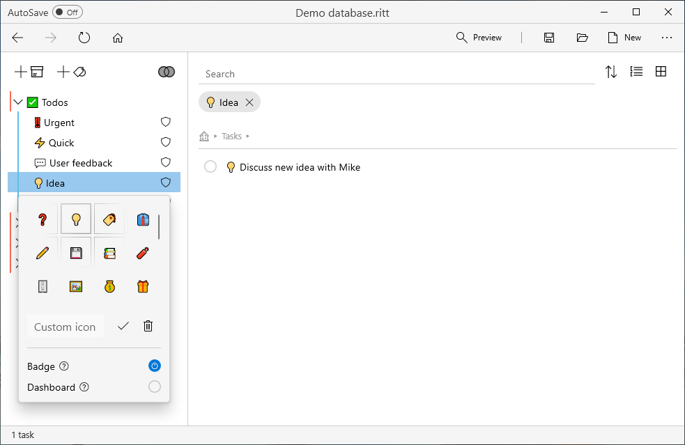
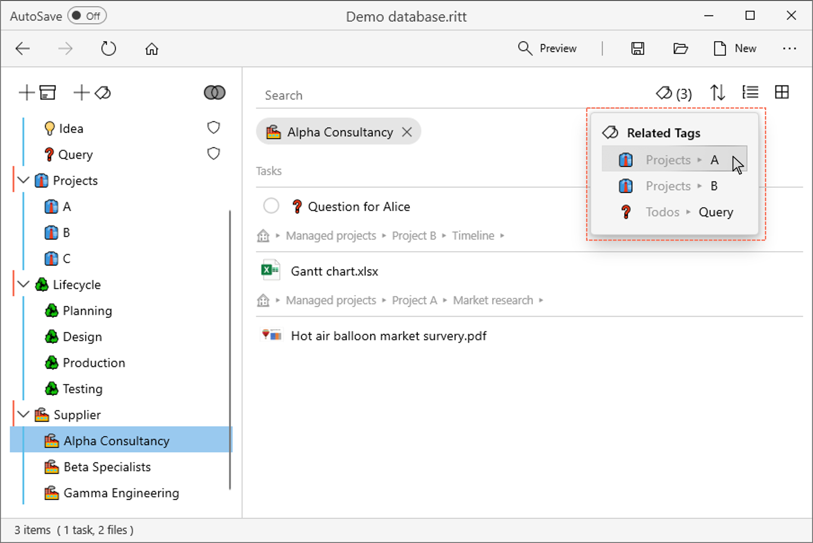
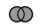

# Tags
{: .no_toc }
 

  

    Table of contents
  

  {: .text-delta }
- TOC
{:toc}

---

## Adding a new tag

- Click on the **Add Tag**  button to add a new tag.
- Enter a suitable name for the new tag.     
- After the first tag has been created, you can also add new tags by dragging and dropping the **Add Tag** button to a desired position in the list of existing tags.  
    <video autoplay loop width="500" controls>
    <source src="../img/MOV-Drag-Drop-New-Tag.mov" type="video/mp4">
    </video>

---

## Tagging files, folders, or tasks

- Navigate to and select the files, folders or tasks that you wish to tag.
- Tag the item by clicking on the empty circle next to the tag. This creates a *direct* tag.     

When you tag a folder, all items within that folder become *indirectly* tagged to that tag. In the example below, the folder "Market research" is directly tagged to <mark style="background-color: #FFF0EE">Planning</mark>, but because it is also a subfolder of "Project A" (which is tagged to <mark style="background-color: #FFF0EE">Projects &#x25B6; A</mark>), it will also be indirectly tagged to <mark style="background-color: #FFF0EE">Projects &#x25B6; A</mark>.   

---

## Creating nested tags

- When you create many tags, you may want to organize the tags hierarchically.
- Drag and drop children tags into parent tags.  
    <video autoplay loop width="500" controls>
    <source src="../img/MOV-Drag-Children-to-Parent-Tag.mov" type="video/mp4">
    </video>

---

## Activating a tag

- In the tag tree (left panel), navigate to and click on a desired tag to activate it.
- Tagged items and tasks will be displayed in the right panel.
- You can also view [*Related Tags*](#related-tags) (if available) through a dropdown menu next to the Search bar.
   

---

## Activating multiple tags

- Double click on another tag under *Related Tags* to activate it. You will now see items that are tagged to both tags.
- Alternatively, in the tag tree on the left pane, Ctrl + click (or middle mouse button click) on another tag to activate it.   

---

## Creating a tag out of an item

Sometimes, you may wish to turn an existing item (e.g., a folder, a file or a task) into a tag.

- Drag and drop the item to a desired position in the tag tree on the left pane. This will create a tag with the same name as the item, and the item itself will be tagged to this new tag. 

(Note: Renaming this tag will not affect the original name of the item.)

### Creating mirror tags

Creating a tag out of a **folder** in this manner will create a **mirror tag** with some special properties. 
<video autoplay loop width="800" controls>
<source src="../img/MOV-Add-Mirror-Tag.mov" type="video/mp4">
</video>

When you drag and drop a folder onto the tag pane, it will create a mirror tag with the same name as the folder, and the folder itself will be tagged to this new tag. Any items within the folder will also be indirectly tagged to the mirror tag. Renaming the mirror tag does not affect the name of the original folder.

A mirror tag serves both as a tag and as a folder. When you select a mirror tag, it shows the contents of the folder. You can also add new files or subfolders into this folder, because Ritt knows the exact location to add them to.

Tag relevant items from other locations to this mirror tag to see all items related to a project in one place! 
<video autoplay loop width="800" controls>
<source src="../img/MP4-Mirror-Tags.mp4" type="video/mp4">
</video>

---

## Tag icon and attributes

- Right click on a tag and select **Icon and Attributes**.
- Here you can assign an icon (emoji) to your tag.
- Check the attribute **Badge** to show the tag icon in front of all items with that tag.
- Check the attribute **Skip-Level** to include and show all items tagged to the children tag(s) of the selected tag.  

---

## Renaming, Duplicating, or Removing tags

- To rename a tag, right click on the tag and select **Rename**, or hit the `F2` key on your keyboard.
- To duplicate a tag, right click on the tag and select **Duplicate**.
- To remove a tag, right click on the tag and select **Delete**, or hit the `DELETE` key on your keyboard.

---

## Related tags

Related tags are tags which have common items with currently activated tag(s). This feature helps you to quickly locate the files you are looking for by "narrowing your search".

After [activating one or more tags](#activating-a-tag), you will see a button  next to the Search bar if related tags are available. (The number in brackets is the number of related tags available.)

- Click on this button to show the related tags.    

- Select a related tag, and that tag will also be activated alongside any others that have already been activated. In the main panel, you will see items which are tagged to all the activated tags.    

---

## Intersection mode vs. Union mode

When you [activate multiple tags](#activating-multiple-tags), you can decide if you would like to view tagged items in intersection mode or union mode.

1. **Intersection mode** - view items that are tagged to ***all*** of the activated tags

2. **Union mode** - view items that are tagged to ***any*** of the activated tags

The default mode is the intersection mode. To toggle between the two modes, click on the button with two circles at the top right-hand corner of the tag pane.

- Click on  to switch to the union mode.

- Click on  to switch to the intersection mode.

---

## Show / Select tags

- Right click on an item and select **Show tags** to *display* all tags associated with this item on the tag pane.

- Right click on an item and select **Select tags** to *activate* all tags associated with this item.

If you do not see these options, it means that the item you've selected does not have any tags. 
<video autoplay loop width="800" controls>
<source src="../img/MP4-Show-Select-Tags.mp4" type="video/mp4">
</video>

